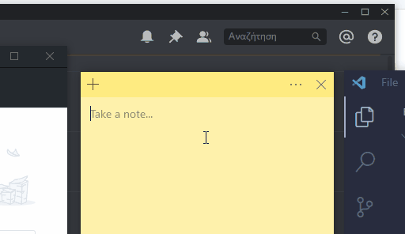

# Autocorrect

Autocorrect for your PC with Python, for optimizing writing speed and using less keystrokes.



# Things I used

- [Pynput](https://github.com/moses-palmer/pynput/) για τον έλεγχο του πληκτρολογίου
- [Hunspell](http://hunspell.github.io/) για την διαχείριση του λεξικού και την αναζήτηση suggestions (κάτι που χρησιμοποιείται σε πολλά δημοφιλή προγράμματα όπως Google Chrome, Firefox, LibreOffice, OpenOffice) και [αυτό](https://github.com/MSeal/cython_hunspell)
- 10000 πιο συχνές λέξεις από το Google's Trillion Word Corpus, από [αυτό το repo](https://github.com/first20hours/google-10000-english)
- [12dicts](http://wordlist.aspell.net/12dicts/)
- [Chromium dictionaries](https://chromium.googlesource.com/chromium/deps/hunspell_dictionaries/)

# Features

- Αν γράψεις λανθασμένη λέξη, την αντικαθιστά με την κοντινότερη σωστή
- Όταν πατάς κενό, τελεία, κόμμα, ή enter, γίνεται η αντικατάσταση
- Μετατρέπει τα **greeklish σε Ελληνικά**!🎉
- Δουλεύει _οπουδήποτε στον υπολογιστή σου_!👈
- Αν η μετατροπή δεν σου αρέσει, πατώντας Backspace θα σταματήσει η αναγνώριση για να μπορέσεις να την διορθώσεις χειροκίνητα
- Κάνει ανάλυση συχνότητας στις λέξεις για να σου εμφανίσει αυτήν που είναι πιο πιθανό ότι ήθελες να γράψεις

# How to use it

- Clone the project
- Install dependencies

```
pip install cyhunspell
pip install pynput
```

- Run `script.py`

```
python3 script.py
```

- Press Escape to stop it

Το πιθανότερο είναι να δουλεύει σε όλα τα OS.

# Επικοινωνία

Για οποιοδήποτε θέμα, επικοινωνήστε μαζί μου!
